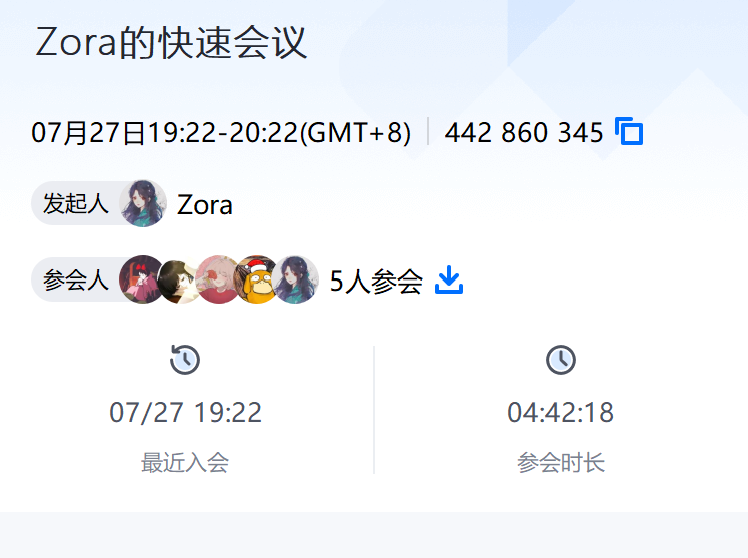

# 场景化漏洞攻击

## 一、会议记录

## 二、参考链接

[log4j2漏洞复现(CVE-2021-44228)](https://huaweicloud.csdn.net/63312469d3efff3090b53b06.html)

[JNDI 介绍和使用](https://blog.csdn.net/conquer0715/article/details/10031577)

[log4j2漏洞复现](https://blog.csdn.net/weixin_45585955/article/details/124720629)

[JNDIExploit-1](https://github.com/Jeromeyoung/JNDIExploit-1)

[虚拟机访问不能ping通域名，但可以ping通域名对应的ip](https://www.cnblogs.com/wekenyblog/p/17462174.html)

[curl: no url specified!](https://wenku.csdn.net/answer/aa2af35111f60d293ad1087f2872c0f4)