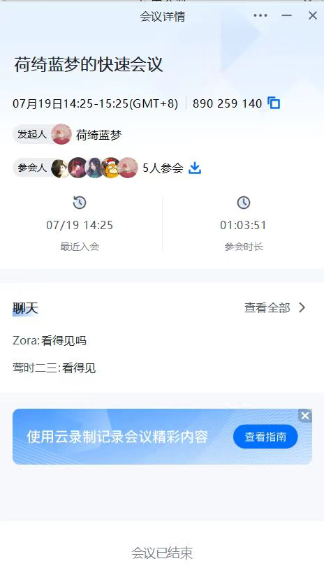

# 环境配置及修理虚拟机

### 一、日程内容

- 修改`webgoat8`默认监听 8088 端口避免和 juice-shop 的端口占用冲突

  ```bash
  # 一次获取所有文件（包括所有子模块管理的文件）
  $ git clone https://github.com/c4pr1c3/ctf-games.git --recursive
  
  $ cd ctf-games
  
  # （可选）单独更新子模块
  $ git submodule init && git submodule update
  
  # 启动 webgoat 系列服务
  $ cd owasp/webgoat/ && docker-compose up -d
  
  # 启动 juice-shop 及 shake-logger 服务
  $ cd ../../owasp/juice-shop/ && docker-compose up -d
  ```

  

  

- 添加`vulfocus`的 docker-compose 编排封装

  ```bash
  # 将当前用户添加到 docker 用户组，免 sudo 执行 docker 相关指令
  $ sudo apt update && sudo apt install -y docker.io docker-compose jq
  
  # 重新登录 shell 生效
  $ sudo usermod -a -G docker ${USER}
  
  # 切换到 root 用户
  $ sudo su -
  
  # 使用中科大 Docker Hub 镜像源
  cat <<EOF > /etc/docker/daemon.json
  {
    "registry-mirrors": ["https://docker.mirrors.ustc.edu.cn/"]
  }
  EOF
  
  # 重启 docker 守护进程
  $ systemctl restart docker
  
  # 提前拉取 vulfocus 镜像
  $ docker pull vulfocus/vulfocus:latest
  ```

  

  

### 二、会议记录





